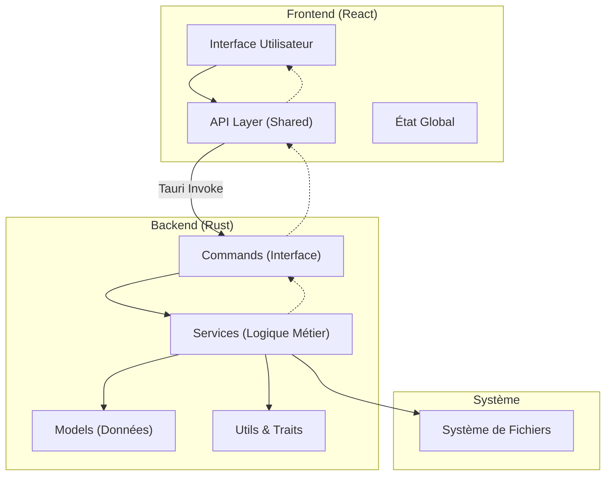

# Architecture du Projet FastCull

Ce document détaille l'architecture technique et l'organisation du code du projet FastCull.

## Vue d'ensemble

FastCull est une application de bureau construite avec **Tauri** (Rust) pour le backend et **React** (Vite) pour le frontend. L'objectif est d'offrir des performances natives pour le tri de photos tout en conservant une interface utilisateur moderne et flexible.



## Structure des Dossiers

L'arborescence du projet est divisée en deux parties principales : le frontend et le backend.

### 1. Frontend (`/frontend`)

Le frontend suit une architecture modulaire inspirée de _Feature-Sliced Design_ pour garantir la scalabilité.

```text
frontend/
├── src/
│   ├── app/          # Configuration globale (Providers, Router, Styles globaux)
│   ├── pages/        # Composition des pages (Routing)
│   ├── widgets/      # Blocs UI autonomes et complexes (ex: Header, Sidebar)
│   ├── features/     # Fonctionnalités métier (ex: PhotoGrid, RatingSystem)
│   ├── entities/     # Modèles métier et Types
│   │   └── generated/ # Types TypeScript générés automatiquement depuis Rust
│   └── shared/       # Code partagé et réutilisable
│       ├── api/      # Wrappers pour les commandes Tauri
│       ├── ui/       # Composants UI atomiques (Boutons, Inputs)
│       └── lib/      # Utilitaires généraux
├── public/           # Assets statiques
└── ...config files   # (vite.config.ts, package.json, etc.)
```

### 2. Backend (`/src-tauri`)

Le backend Rust est structuré pour séparer clairement l'exposition des commandes de la logique métier.

```text
src-tauri/
├── src/
│   ├── commands/     # Points d'entrée exposés au Frontend (#[tauri::command])
│   ├── services/     # Logique métier pure (indépendante de Tauri si possible)
│   ├── models/       # Structures de données (Structs, Enums)
│   ├── traits/       # Interfaces et Traits partagés
│   ├── utils/        # Fonctions utilitaires transverses
│   ├── lib.rs        # Point d'entrée de la librairie, enregistrement des modules
│   └── main.rs       # Point d'entrée de l'exécutable
├── bindings/         # Fichiers TypeScript générés par ts-rs
└── ...config files   # (Cargo.toml, tauri.conf.json)
```

### 3. Documentation & CI

- `docs/` : Documentation du projet (Architecture, Contribution, etc.).
- `.github/workflows/ci.yml` : Pipeline d'Intégration Continue (CI) pour tester et builder le projet sur Linux, Windows et macOS.

## Concepts Clés

### Flux de Données

1.  **Appel** : Le Frontend appelle une fonction via `shared/api`, qui utilise `invoke` de Tauri.
2.  **Commande** : Une fonction dans `src-tauri/src/commands/` reçoit la requête. Elle valide les entrées et appelle le service approprié.
3.  **Traitement** : Le service (`src-tauri/src/services/`) effectue le travail (lecture fichier, traitement image, DB) en utilisant les modèles (`models/`).
4.  **Réponse** : Le résultat est renvoyé à la commande, puis au frontend.

### Partage de Types (Rust -> TypeScript)

Nous utilisons la crate `ts-rs` pour garantir la cohérence des types entre le backend et le frontend.

- Les structures Rust dans `models/` sont décorées avec `#[derive(TS)]`.
- Lors de la compilation (ou via un test dédié), `ts-rs` génère les définitions TypeScript dans `src-tauri/bindings/`.
- Un lien symbolique (ou une copie) rend ces fichiers accessibles dans `frontend/src/entities/generated/`.
- Le frontend importe ces types pour garantir que les données reçues du backend sont correctement typées.
